# Complete Mathematical & Statistical Inventory: Energy-Intelligence-System

This repository is a **UK national electricity grid demand forecasting research monorepo** (v1→v7 + SSM). Mathematics appears in **68 Python files** across EDA, feature engineering, classical ML, deep sequence models, probabilistic state-space models, and evaluation. Below is an exhaustive concept-by-concept breakdown.

---

## PART I — CONCEPT CATALOGUE

Concepts are grouped by category but numbered continuously for reference.

---

### A. LINEAR ALGEBRA & DIMENSIONALITY REDUCTION

---

#### 1. Principal Component Analysis (PCA)

| Field            | Detail                                                                                                                                                                                                                                                                                                                                                                                          |
| ------------------| -------------------------------------------------------------------------------------------------------------------------------------------------------------------------------------------------------------------------------------------------------------------------------------------------------------------------------------------------------------------------------------------------|
| **Category**     | Linear Algebra, Multivariate Statistics                                                                                                                                                                                                                                                                                                                                                         |
| **Formulation**  | Given centered data matrix $\mathbf{X} \in \mathbb{R}^{n \times p}$, compute covariance $\mathbf{C} = \frac{1}{n-1}\mathbf{X}^\top\mathbf{X}$. Eigen-decompose $\mathbf{C} = \mathbf{V}\boldsymbol{\Lambda}\mathbf{V}^\top$. Project: $\mathbf{Z} = \mathbf{X}\mathbf{V}_k$. Explained variance ratio: $\lambda_i / \sum_j \lambda_j$. Cumulative: $\sum_{i=1}^k \lambda_i / \sum_j \lambda_j$. |
| **Intuition**    | Find orthogonal directions of maximum variance; compress correlated grid variables (interconnectors, generation mix, capacity) into low-dimensional regime indicators.                                                                                                                                                                                                                          |
| **Where**        | `HMM/src/pca.py` (`PCA(n_components=0.95)` on interconnect/generation/capacity blocks); `v1 (test)/EDA/pca.py`; `XGB/EDA/eda.py`; `LTNT/src/diagnostics.py` (`plot_latent_trajectory`); `SSM/src/eval.py` (import only)                                                                                                                                                                         |
| **Project use**  | Three separate PCAs → `INTER_PC*`, `GEN_PC*`, `CAP_PC*` saved to `datalake/pca/df_pca.parquet`. PC0 of each block becomes HMM/MoE/TFT input. v1 uses PCA on substation loads to define grid regimes (PC1+PC2 ≈ 79% variance).                                                                                                                                                                   |
| **Dependencies** | Covariance matrix, eigenvalues/eigenvectors, standardization                                                                                                                                                                                                                                                                                                                                    |
| **Pitfalls**     | PCA on non-stationary time series mixes temporal structure into components; separate scalers per block in `HMM/src/pca.py` is correct but cross-block correlation is lost; `n_components=0.95` is data-dependent.                                                                                                                                                                               |
| **Related**      | StandardScaler, GMM, t-SNE, explained variance                                                                                                                                                                                                                                                                                                                                                  |

---

#### 2. Standardization (Z-Score Scaling)

| Field            | Detail                                                                                                                                                                                                                                                                                                    |
| ---------------- | --------------------------------------------------------------------------------------------------------------------------------------------------------------------------------------------------------------------------------------------------------------------------------------------------------- |
| **Category**     | Linear Algebra, Preprocessing                                                                                                                                                                                                                                                                             |
| **Formulation**  | $x'_j = (x_j - \mu_j) / \sigma_j$ where $\mu_j, \sigma_j$ are column mean and std fit on training data only.                                                                                                                                                                                              |
| **Intuition**    | Put features on comparable scales so distance-based and gradient-based methods converge.                                                                                                                                                                                                                  |
| **Where**        | `HMM/src/pca.py`, `HMM/src/gmm.py`, `HMM/src/feature_prep.py`, `HMM/src/train.py`, `MOE/src/feature_prep.py`, `TFT/src/feature_prep.py`, `LTNT/src/feature_prep.py`, `ATTN/src/feature_prep.py`, `XGB/src/models/baseline.py`, `v1 (test)/EDA/pca.py`, `v1 (test)/regime_classifier/regime_classifier.py` |
| **Project use**  | Universal preprocessing before PCA, GMM, XGBoost, neural nets. Strict train-only fit in all `normalize_data()` functions.                                                                                                                                                                                 |
| **Dependencies** | Mean, variance                                                                                                                                                                                                                                                                                            |
| **Pitfalls**     | Fitting scaler on full dataset leaks future statistics (avoided in tensor pipelines but not in `HMM/src/gmm.py` which fits on all PCA data).                                                                                                                                                              |
| **Related**      | RobustScaler, MinMax (not used)                                                                                                                                                                                                                                                                           |

---

#### 3. Robust Scaling (Median/IQR)

| Field            | Detail                                                                                                                                      |
| ---------------- | ------------------------------------------------------------------------------------------------------------------------------------------- |
| **Category**     | Robust Statistics, Preprocessing                                                                                                            |
| **Formulation**  | $x' = (x - \text{median}(x)) / \text{IQR}(x)$. sklearn `RobustScaler` uses $Q_3 - Q_1$.                                                     |
| **Intuition**    | Resistant to outliers in macro/weather/demand series with missing data and spikes.                                                          |
| **Where**        | `SSM/src/feature_prep.py` — `fit_scaler()`, `transform_data()`                                                                              |
| **Project use**  | SSM daily tensors with outer-joined multi-source data (demand, generation, weather, macro). NaN columns get center=0, scale=1 pass-through. |
| **Dependencies** | Quantiles, IQR                                                                                                                              |
| **Pitfalls**     | All-NaN columns during training produce NaN scale; code patches with `nan_to_num`.                                                          |
| **Related**      | StandardScaler, missingness masks                                                                                                           |

---

#### 4. Covariance Matrix & Matrix Rank / Condition Number

| Field            | Detail                                                                                                                                                          |
| ---------------- | --------------------------------------------------------------------------------------------------------------------------------------------------------------- |
| **Category**     | Linear Algebra                                                                                                                                                  |
| **Formulation**  | $\mathbf{C}_{ij} = \text{Cov}(X_i, X_j)$. Rank = number of linearly independent columns. Condition number $\kappa(\mathbf{C}) = \lambda_{\max}/\lambda_{\min}$. |
| **Intuition**    | Detect collinear features that break GMM/HMM/PCA numerically.                                                                                                   |
| **Where**        | `HMM/src/feature_prep.py` (`np.cov`, `np.linalg.matrix_rank`, `np.linalg.cond`); `HMM/src/train.py` (same hygiene check)                                        |
| **Project use**  | Validates 4-feature HMM input `[ND, INTER_PC0, GEN_PC0, CAP_PC0]` before training. Raises error if rank-deficient.                                              |
| **Dependencies** | Linear algebra, PCA                                                                                                                                             |
| **Pitfalls**     | High condition number → unstable GMM covariances even if full rank.                                                                                             |
| **Related**      | PCA, GMM, multicollinearity                                                                                                                                     |

---

#### 5. t-SNE (t-Distributed Stochastic Neighbor Embedding)

| Field            | Detail                                                                                                                                |
| ---------------- | ------------------------------------------------------------------------------------------------------------------------------------- |
| **Category**     | Nonlinear Dimensionality Reduction, Manifold Learning                                                                                 |
| **Formulation**  | Minimizes KL divergence between pairwise similarities in high-D (Gaussian) and low-D (Student-t) spaces: $C = \text{KL}(P \Vert  Q)$. |
| **Intuition**    | Visualize 32-D latent trajectories from LTNT in 2-D for interpretability.                                                             |
| **Where**        | `LTNT/src/diagnostics.py` — `plot_latent_trajectory(..., method='tsne')`                                                              |
| **Project use**  | Diagnostic only — checks whether continuous latent states form structured trajectories vs. noise.                                     |
| **Dependencies** | KL divergence, PCA (alternative in same function)                                                                                     |
| **Pitfalls**     | t-SNE distances are not metric; not for quantitative analysis.                                                                        |
| **Related**      | PCA, latent state visualization                                                                                                       |

---

#### 6. Vector/Matrix Operations in Neural Networks

| Field            | Detail                                                                                                                                                                                                                                   |
| ---------------- | ---------------------------------------------------------------------------------------------------------------------------------------------------------------------------------------------------------------------------------------- |
| **Category**     | Linear Algebra                                                                                                                                                                                                                           |
| **Formulation**  | $\mathbf{y} = \mathbf{W}\mathbf{x} + \mathbf{b}$; `einsum('bk,bkd->bd', r, expert_outputs)` for regime-weighted expert mixing; batched matrix multiply in attention: $\text{softmax}(\mathbf{Q}\mathbf{K}^\top / \sqrt{d_h})\mathbf{V}$. |
| **Intuition**    | Core computation in all PyTorch models.                                                                                                                                                                                                  |
| **Where**        | All `models/*.py`, `SSM/src/models/ssm.py` (einsum), `TFT/src/models/attention.py` (bmm)                                                                                                                                                 |
| **Project use**  | Regime-weighted MoE transition in SSM; attention in TFT/MoE/LTNT/ATTN.                                                                                                                                                                   |
| **Dependencies** | Matrix multiplication, tensor broadcasting                                                                                                                                                                                               |
| **Pitfalls**     | TF32 on Ampere GPUs (`torch.backends.cuda.matmul.allow_tf32`) reduces precision.                                                                                                                                                         |
| **Related**      | Attention, MoE                                                                                                                                                                                                                           |

---

### B. PROBABILITY & STATISTICS

---

#### 7. Pearson Correlation Coefficient

| Field            | Detail                                                                                                                                                                            |
| ---------------- | --------------------------------------------------------------------------------------------------------------------------------------------------------------------------------- |
| **Category**     | Statistics                                                                                                                                                                        |
| **Formulation**  | $r_{xy} = \frac{\sum(x_i - \bar{x})(y_i - \bar{y})}{\sqrt{\sum(x_i-\bar{x})^2}\sqrt{\sum(y_i-\bar{y})^2}}$                                                                        |
| **Intuition**    | Measure linear association between variables (e.g., renewables vs carbon intensity).                                                                                              |
| **Where**        | `XGB/EDA/eda.py` (`scipy.stats.pearsonr`); `v1 (test)/EDA/correlation.py` (`.corr()`); `v1 (test)/regime_classifier/pc2_validation.py`; `LTNT/src/diagnostics.py` (`np.corrcoef`) |
| **Project use**  | EDA: solar/wind/hydro vs carbon; PC2 vs substation mean/std; latent dimension vs vol/trend correlation.                                                                           |
| **Dependencies** | Mean, variance                                                                                                                                                                    |
| **Pitfalls**     | Correlation ≠ causation; non-stationarity inflates spurious correlation.                                                                                                          |
| **Related**      | Covariance matrix, heatmaps                                                                                                                                                       |

---

#### 8. Gaussian (Normal) Distribution

| Field            | Detail                                                                                                                                                                      |
| ---------------- | --------------------------------------------------------------------------------------------------------------------------------------------------------------------------- |
| **Category**     | Probability                                                                                                                                                                 |
| **Formulation**  | $p(x\vert \mu,\sigma^2) = \frac{1}{\sqrt{2\pi\sigma^2}} \exp\left(-\frac{(x-\mu)^2}{2\sigma^2}\right)$. Multivariate: $\mathcal{N}(\boldsymbol{\mu}, \boldsymbol{\Sigma})$. |
| **Intuition**    | Assumed emission distribution for HMM observations and SSM demand/generation outputs.                                                                                       |
| **Where**        | `HMM/src/models/hmm.py` (`emission_log_prob`); `SSM/src/models/ssm.py` (emissions, transitions, reparameterization); `SSM/src/eval.py` (`scipy.stats.norm`)                 |
| **Project use**  | Neural HMM diagonal Gaussian emissions per state; SSM probabilistic emissions with learned variance via softplus.                                                           |
| **Dependencies** | Log-likelihood, variance parameterization                                                                                                                                   |
| **Pitfalls**     | Variance collapse (SSM uses `softplus + 1e-4` floor); diagonal covariance ignores cross-feature correlation.                                                                |
| **Related**      | GMM, NLL, CRPS, KL divergence                                                                                                                                               |

---

#### 9. Gaussian Mixture Model (GMM)

| Field            | Detail                                                                                                                                                                                                                       |
| ---------------- | ---------------------------------------------------------------------------------------------------------------------------------------------------------------------------------------------------------------------------- |
| **Category**     | Probabilistic Modeling, EM Algorithm (implicit)                                                                                                                                                                              |
| **Formulation**  | $p(\mathbf{x}) = \sum_{k=1}^K \pi_k \mathcal{N}(\mathbf{x}\vert \boldsymbol{\mu}_k, \boldsymbol{\Sigma}_k)$. EM alternates E-step (responsibilities) and M-step (update $\pi_k, \boldsymbol{\mu}_k, \boldsymbol{\Sigma}_k$). |
| **Intuition**    | Discover 4 latent grid "regimes" in PCA space before HMM training.                                                                                                                                                           |
| **Where**        | `HMM/src/gmm.py` — 4-component full covariance GMM; `HMM/src/train.py` — diag GMM init for NeuralHMM                                                                                                                         |
| **Project use**  | Regime interpretation (persistence, balance, mean PCA features per regime). Initializes HMM emission means/variances and target means from cluster centroids.                                                                |
| **Dependencies** | Multivariate Gaussian, StandardScaler, PCA                                                                                                                                                                                   |
| **Pitfalls**     | `gmm.py` fits on all data (no train split); component collapse if K too large; full vs diag covariance choice differs between scripts.                                                                                       |
| **Related**      | HMM, EM, regime classification                                                                                                                                                                                               |

---

#### 10. Shannon Entropy

| Field            | Detail                                                                                                                                                                           |
| ---------------- | -------------------------------------------------------------------------------------------------------------------------------------------------------------------------------- |
| **Category**     | Information Theory                                                                                                                                                               |
| **Formulation**  | $H(p) = -\sum_k p_k \log p_k$                                                                                                                                                    |
| **Intuition**    | Penalize regime collapse (all mass on one state) and encourage diverse routing.                                                                                                  |
| **Where**        | `HMM/src/models/hmm.py` (gamma entropy, transition entropy); `ATTN/src/train.py` (`compute_regime_losses`); `SSM/src/models/ssm.py` (`entropy_categorical`)                      |
| **Project use**  | HMM: maximize $H(\gamma)$ and $H(A)$ to prevent sticky single-regime posteriors. ATTN: entropy bonus early training. SSM: maximize posterior regime entropy to prevent collapse. |
| **Dependencies** | Softmax probabilities                                                                                                                                                            |
| **Pitfalls**     | Maximizing entropy conflicts with sharp regime identification; scheduled via `lambda1` decay in ATTN.                                                                            |
| **Related**      | KL divergence, load balancing                                                                                                                                                    |

---

#### 11. Kullback–Leibler (KL) Divergence

| Field            | Detail                                                                                                                                                                                                                                                                                                                                                                                                                                 |
| ---------------- | -------------------------------------------------------------------------------------------------------------------------------------------------------------------------------------------------------------------------------------------------------------------------------------------------------------------------------------------------------------------------------------------------------------------------------------- |
| **Category**     | Information Theory, Variational Inference                                                                                                                                                                                                                                                                                                                                                                                              |
| **Formulation**  | Gaussian: $\text{KL}(q\Vert p) = \frac{1}{2}\left[\log\frac{\vert \boldsymbol{\Sigma}_p\vert }{\vert \boldsymbol{\Sigma}_q\vert } - d + \text{tr}(\boldsymbol{\Sigma}_p^{-1}\boldsymbol{\Sigma}_q) + (\boldsymbol{\mu}_p - \boldsymbol{\mu}_q)^\top\boldsymbol{\Sigma}_p^{-1}(\boldsymbol{\mu}_p - \boldsymbol{\mu}_q)\right]$. Diagonal implementation in code. Categorical: $\text{KL}(q\Vert p) = \sum_k q_k(\log q_k - \log p_k)$. |
| **Intuition**    | Measure how far posterior deviates from prior — core VAE/SSM regularizer.                                                                                                                                                                                                                                                                                                                                                              |
| **Where**        | `SSM/src/models/ssm.py` — `kl_divergence_gaussian`, `kl_divergence_categorical`; `ATTN/src/train.py` — load balancing KL to uniform                                                                                                                                                                                                                                                                                                    |
| **Project use**  | SSM: align bidirectional posterior $(z_t, r_t)$ with forward prior dynamics. ATTN: penalize deviation of global regime occupancy from uniform $1/K$.                                                                                                                                                                                                                                                                                   |
| **Dependencies** | Gaussian, categorical distributions, ELBO                                                                                                                                                                                                                                                                                                                                                                                              |
| **Pitfalls**     | KL vanishing (posterior collapses to prior); mitigated by free-bits and annealing in SSM.                                                                                                                                                                                                                                                                                                                                              |
| **Related**      | ELBO, free bits, variational inference                                                                                                                                                                                                                                                                                                                                                                                                 |

---

#### 12. Gaussian Negative Log-Likelihood (NLL)

| Field            | Detail                                                                                          |
| ---------------- | ----------------------------------------------------------------------------------------------- |
| **Category**     | Probabilistic Loss, Maximum Likelihood                                                          |
| **Formulation**  | $-\log p(y\vert \mu,\sigma^2) = \frac{1}{2}\log(2\pi\sigma^2) + \frac{(y-\mu)^2}{2\sigma^2}$    |
| **Intuition**    | Probabilistic reconstruction loss — penalizes both mean error and miscalibrated uncertainty.    |
| **Where**        | `SSM/src/models/ssm.py` — `SSMLoss.gaussian_nll()`; `SSM/src/eval.py` (metric computation)      |
| **Project use**  | Primary SSM training objective for demand and generation emissions, masked for missing targets. |
| **Dependencies** | Gaussian distribution, missingness masks                                                        |
| **Pitfalls**     | Model can minimize NLL by inflating variance; KL terms constrain this.                          |
| **Related**      | CRPS, MSE, heteroscedastic regression                                                           |

---

#### 13. Continuous Ranked Probability Score (CRPS) — Gaussian Closed Form

| Field            | Detail                                                                                                                                                                                                  |
| ---------------- | ------------------------------------------------------------------------------------------------------------------------------------------------------------------------------------------------------- |
| **Category**     | Probabilistic Forecast Evaluation                                                                                                                                                                       |
| **Formulation**  | For Gaussian forecast: $\text{CRPS}(\mathcal{N}(\mu,\sigma^2), y) = \sigma\left[z(2\Phi(z)-1) + 2\phi(z) - 1/\sqrt{\pi}\right]$ where $z = (y-\mu)/\sigma$, $\Phi,\phi$ are CDF/PDF of standard normal. |
| **Intuition**    | Proper scoring rule evaluating full predictive distribution, not just point forecast.                                                                                                                   |
| **Where**        | `SSM/src/eval.py` — `crps_gaussian()`                                                                                                                                                                   |
| **Project use**  | Evaluates SSM probabilistic demand/generation forecasts alongside NLL and 90% coverage.                                                                                                                 |
| **Dependencies** | Normal CDF/PDF (`scipy.stats.norm`)                                                                                                                                                                     |
| **Pitfalls**     | Assumes Gaussian forecasts; miscalibrated variance still affects CRPS.                                                                                                                                  |
| **Related**      | NLL, prediction intervals, fan charts                                                                                                                                                                   |

---

#### 14. Prediction Intervals & Coverage

| Field            | Detail                                                                                                                                                      |
| ---------------- | ----------------------------------------------------------------------------------------------------------------------------------------------------------- |
| **Category**     | Statistics, Uncertainty Quantification                                                                                                                      |
| **Formulation**  | 90% interval: $[\mu - 1.645\sigma, \mu + 1.645\sigma]$. Coverage = fraction of $y$ falling inside interval. Fan chart uses 10th–90th: $\mu \pm 1.28\sigma$. |
| **Intuition**    | Check if predicted uncertainty matches empirical frequency.                                                                                                 |
| **Where**        | `SSM/src/eval.py`                                                                                                                                           |
| **Project use**  | 90% coverage metric for SSM; fan chart visualization with regime-colored background.                                                                        |
| **Dependencies** | Gaussian emissions, z-scores                                                                                                                                |
| **Pitfalls**     | Under-coverage if variance too small; assumes symmetric Gaussian.                                                                                           |
| **Related**      | CRPS, NLL, quantile regression (TFT paper, not fully implemented)                                                                                           |

---

#### 15. Quantiles & Percentile Binning

| Field            | Detail                                                                                                                                      |
| ---------------- | ------------------------------------------------------------------------------------------------------------------------------------------- |
| **Category**     | Descriptive Statistics                                                                                                                      |
| **Formulation**  | $Q_p$: value where $P(X \leq Q_p) = p$. `np.percentile`, `np.digitize`.                                                                     |
| **Intuition**    | Stratify analysis by PC2 regime or volatility quintiles.                                                                                    |
| **Where**        | `v1 (test)/regime_classifier/pc2_validation.py` (PC2 quartile binning); `LTNT/src/diagnostics.py` (volatility quintiles for error analysis) |
| **Project use**  | PC2 structural validation; error-by-volatility diagnostic plots.                                                                            |
| **Dependencies** | Order statistics                                                                                                                            |
| **Pitfalls**     | Quantile boundaries sensitive to sample size.                                                                                               |
| **Related**      | RobustScaler (uses IQR)                                                                                                                     |

---

#### 16. Rolling Statistics (Mean, Std)

| Field            | Detail                                                                                                                                                                                                                                                                            |
| ---------------- | --------------------------------------------------------------------------------------------------------------------------------------------------------------------------------------------------------------------------------------------------------------------------------- |
| **Category**     | Time Series Statistics                                                                                                                                                                                                                                                            |
| **Formulation**  | Rolling mean: $\bar{x}_t^{(w)} = \frac{1}{w}\sum_{i=0}^{w-1} x_{t-i}$. Rolling std: $\sqrt{\frac{1}{w-1}\sum_{i=0}^{w-1}(x_{t-i} - \bar{x}_t)^2}$.                                                                                                                                |
| **Intuition**    | Capture local level, volatility, and smoothed regime indicators.                                                                                                                                                                                                                  |
| **Where**        | Widespread: `XGB/src/feature_engineering.py`, `MOE/src/feature_prep.py`, `LTNT/src/feature_prep.py`, `ATTN/src/feature_prep.py`, `TFT/src/feature_prep.py`, `SSM/src/feature_prep.py`, `v1 (test)/regime_classifier/regime_classifier.py`, `v1 (test)/EDA/autocorr+volatility.py` |
| **Project use**  | Volatility targets (`TARGET_VOL = rolling(48).std()`), gate features (smoothed ND), carbon rolling mean, SSM 7/30-day roll stats.                                                                                                                                                 |
| **Dependencies** | Window functions, shift/lag                                                                                                                                                                                                                                                       |
| **Pitfalls**     | Look-ahead if rolling includes current point for targets (code uses `.shift(-1)` for vol/trend targets).                                                                                                                                                                          |
| **Related**      | Lag features, differencing, FFT                                                                                                                                                                                                                                                   |

---

#### 17. Autocorrelation Function (ACF)

| Field            | Detail                                                                                                              |
| ---------------- | ------------------------------------------------------------------------------------------------------------------- |
| **Category**     | Time Series Analysis                                                                                                |
| **Formulation**  | $\rho_k = \frac{\text{Cov}(X_t, X_{t-k})}{\text{Var}(X_t)}$. `statsmodels.tsa.stattools.acf` with FFT acceleration. |
| **Intuition**    | Detect temporal dependence in residuals — uncorrelated residuals indicate adequate modeling.                        |
| **Where**        | `v1 (test)/EDA/autocorr+volatility.py` (`autocorrelation_plot`); `TFT/src/eval.py` (horizon-wide residual ACF)      |
| **Project use**  | v1: total load autocorrelation; TFT eval: average ACF of multi-step forecast errors across 48-step horizon.         |
| **Dependencies** | Stationarity (approximate), FFT for fast ACF                                                                        |
| **Pitfalls**     | Non-stationary demand makes ACF slow-decaying; interpreting multi-step horizon ACF is non-standard.                 |
| **Related**      | Partial autocorrelation (not used), seasonal naive baseline                                                         |

---

#### 18. Distributional Assumptions (Implicit)

| Field            | Detail                                                                                                                        |
| ---------------- | ----------------------------------------------------------------------------------------------------------------------------- |
| **Category**     | Statistics                                                                                                                    |
| **Formulation**  | Various: i.i.d. regression noise (XGB), Gaussian emissions (HMM/SSM), Laplace-like (SmoothL1), Bernoulli/Categorical regimes. |
| **Intuition**    | Each loss function implies a noise model.                                                                                     |
| **Where**        | All training scripts                                                                                                          |
| **Project use**  | SmoothL1Loss ≈ robust to outliers for point forecasts; Gaussian NLL for SSM; MSE for auxiliary vol/trend.                     |
| **Dependencies** | Loss function selection                                                                                                       |
| **Pitfalls**     | SmoothL1 is not exactly Laplace; using MSE on heavy-tailed demand spikes.                                                     |
| **Related**      | NLL, Huber loss                                                                                                               |

---

### C. TIME SERIES METHODS

---

#### 19. Lag Features & Shift Operations

| Field            | Detail                                                                                                                                                                                                             |
| ---------------- | ------------------------------------------------------------------------------------------------------------------------------------------------------------------------------------------------------------------ |
| **Category**     | Time Series Feature Engineering                                                                                                                                                                                    |
| **Formulation**  | $x_{t-k} = \text{shift}(k)$. Multi-horizon target: `TARGET = ND.shift(-HORIZON)` with HORIZON=336 (1 week at 30-min).                                                                                              |
| **Intuition**    | Provide autoregressive information and define prediction horizon.                                                                                                                                                  |
| **Where**        | `XGB/src/feature_engineering.py` (carbon lags 1,2,3,48,336; 1-week target); `SSM/src/feature_prep.py` (lag1, lag7); `v1 (test)/regime_classifier/regime_classifier.py` (48-step lags); `misc_scripts/test_lags.py` |
| **Project use**  | XGB: 336-step-ahead (1 week) demand forecast; SSM: daily lags; v1: 5 daily lag windows.                                                                                                                            |
| **Dependencies** | Temporal ordering, no shuffle in split                                                                                                                                                                             |
| **Pitfalls**     | Data leakage if lags cross train/test boundary (prevented by temporal split).                                                                                                                                      |
| **Related**      | Rolling windows, differencing                                                                                                                                                                                      |

---

#### 20. Differencing & Returns

| Field            | Detail                                                                                                                                                                                                   |
| ---------------- | -------------------------------------------------------------------------------------------------------------------------------------------------------------------------------------------------------- |
| **Category**     | Time Series                                                                                                                                                                                              |
| **Formulation**  | First difference: $\Delta x_t = x_t - x_{t-1}$. Percent change: $r_t = \frac{x_t - x_{t-k}}{x_{t-k}}$.                                                                                                   |
| **Intuition**    | Stationarize series; model changes instead of levels (LTNT/TFT early experiments).                                                                                                                       |
| **Where**        | `MOE/src/feature_prep.py` (`diff1`, `diff2`); `LTNT/src/feature_prep.py`; `TFT/src/feature_prep.py` (`TARGET_ND_DIFF`, `TARGET_TREND = pct_change(48)`); `LTNT/src/train.py` (predicts `TARGET_ND_DIFF`) |
| **Project use**  | v6 LTNT predicts demand difference; TFT v7 switched to absolute multi-step (`ND_CURRENT`) after diff-target caused poor long-horizon performance (documented in `TFT/model_evolution_report.md`).        |
| **Dependencies** | Lag/shift                                                                                                                                                                                                |
| **Pitfalls**     | Reconstructing levels from diffs accumulates error; TFT AR head adds past-level residual.                                                                                                                |
| **Related**      | Autoregressive head, seasonal naive                                                                                                                                                                      |

---

#### 21. Cyclical / Fourier Calendar Encoding

| Field            | Detail                                                                                                                                |
| ---------------- | ------------------------------------------------------------------------------------------------------------------------------------- |
| **Category**     | Time Series, Signal Processing                                                                                                        |
| **Formulation**  | $\sin(2\pi k \cdot t / T)$, $\cos(2\pi k \cdot t / T)$ for period $T$ (24h, 7d, 365.25d). Higher harmonics $k=1..4$ in TFT.           |
| **Intuition**    | Encode periodicity continuously without arbitrary ordinal encoding of hour/day.                                                       |
| **Where**        | `XGB/src/feature_engineering.py`; `MOE/LTNT/ATTN/TFT/SSM feature_prep.py`; `v1 (test)/regime_classifier/regime_classifier.py`         |
| **Project use**  | Hour/day/month cyclical features; TFT uses multi-harmonic Fourier for known future inputs; SSM known inputs include sin/cos calendar. |
| **Dependencies** | Trigonometry, datetime indexing                                                                                                       |
| **Pitfalls**     | Leap years — SSM uses 365.25 for day-of-year; half-hourly vs daily frequency changes period interpretation.                           |
| **Related**      | FFT spectral features, seasonality EDA                                                                                                |

---

#### 22. Temporal Train/Validation/Test Split

| Field            | Detail                                                                                                                                 |
| ---------------- | -------------------------------------------------------------------------------------------------------------------------------------- |
| **Category**     | Time Series Validation                                                                                                                 |
| **Formulation**  | Chronological split: train $[0, t_1)$, val $[t_1, t_2)$, test $[t_2, T]$. Ratios: 70/15/15 or fixed dates (SSM: train≤2016, val≤2019). |
| **Intuition**    | Prevent future information leakage — mandatory for forecasting.                                                                        |
| **Where**        | All `train_val_test_split()` / `time_split()` / `XGB/src/utils.py`                                                                     |
| **Project use**  | Universal; SSM uses calendar cutoffs; XGB uses 70/15/15 index split.                                                                   |
| **Dependencies** | Ordered time index                                                                                                                     |
| **Pitfalls**     | Distribution shift between splits (COVID, energy crisis) not handled.                                                                  |
| **Related**      | Walk-forward validation (not implemented)                                                                                              |

---

#### 23. Multi-Step Direct Forecasting

| Field            | Detail                                                                                     |
| ---------------- | ------------------------------------------------------------------------------------------ |
| **Category**     | Time Series Forecasting                                                                    |
| **Formulation**  | Predict vector $\hat{\mathbf{y}}_{t+1:t+H}$ directly from encoder state, not iteratively.  |
| **Intuition**    | Avoid error compounding from recursive forecasting.                                        |
| **Where**        | `TFT/src/train.py`, `TFT/src/eval.py` (horizon=48); `SSM/src/train.py` (horizon=30 daily)  |
| **Project use**  | TFT outputs 48 half-hourly steps jointly; SSM rolls out 30-day daily forecasts.            |
| **Dependencies** | Sequence encoders, horizon slicing in datasets                                             |
| **Pitfalls**     | SSM still autoregresses latent state during rollout; TFT direct but uses AR residual head. |
| **Related**      | Autoregressive test (`TFT/src/test_autoregressive.py`)                                     |

---

#### 24. Naive & Seasonal Naive Baselines

| Field            | Detail                                                                                                                                                     |
| ---------------- | ---------------------------------------------------------------------------------------------------------------------------------------------------------- |
| **Category**     | Time Series Benchmarks                                                                                                                                     |
| **Formulation**  | Naive: $\hat{y}_{t+h} = y_t$. Seasonal naive: $\hat{y}_{t+h} = y_{t+h-s}$ with season $s=48$. Skill score: $1 - \text{MAE}_{model}/\text{MAE}_{baseline}$. |
| **Intuition**    | Minimum bar for forecast value-add.                                                                                                                        |
| **Where**        | `TFT/src/eval.py` (daily naive, skill score); `TFT/src/test_shock_recovery.py` (48-step seasonal naive)                                                    |
| **Project use**  | TFT eval compares horizon-wise MAE to seasonal naive; shock recovery test vs 48-step lag.                                                                  |
| **Dependencies** | MAE                                                                                                                                                        |
| **Pitfalls**     | Strong diurnal seasonality makes seasonal naive competitive at short horizons.                                                                             |
| **Related**      | MAE, horizon degradation plots                                                                                                                             |

---

#### 25. Resampling & Aggregation

| Field            | Detail                                                                                    |
| ---------------- | ----------------------------------------------------------------------------------------- |
| **Category**     | Time Series Preprocessing                                                                 |
| **Formulation**  | Continuous vars: daily mean. Flow vars (MW): daily sum. `resample('D').agg()`.            |
| **Intuition**    | Align heterogeneous half-hourly sources to common daily grid for SSM.                     |
| **Where**        | `SSM/src/feature_prep.py` — `standardise_timeseries()`                                    |
| **Project use**  | Demand/generation summed daily; weather/macro averaged daily; UTC timezone normalization. |
| **Dependencies** | Timezone handling, pandas resample                                                        |
| **Pitfalls**     | Summing MW over 48 periods ≠ average demand; code intentionally sums flows.               |
| **Related**      | Missingness masks, outer join                                                             |

---

#### 26. Supply-Demand Composition Ratios

| Field            | Detail                                                                                                     |
| ---------------- | ---------------------------------------------------------------------------------------------------------- |
| **Category**     | Domain Feature Engineering                                                                                 |
| **Formulation**  | `{FUEL}_SHARE = FUEL / (GENERATION + 1)`; `IMPORT_SHARE`, `SUPPLY_DEMAND_GAP = GENERATION + IMPORTS - ND`. |
| **Intuition**    | Normalize generation mix; capture balance constraints.                                                     |
| **Where**        | `XGB/src/feature_engineering.py`                                                                           |
| **Project use**  | XGB v2 features for 1-week-ahead demand. +1 prevents division by zero.                                     |
| **Dependencies** | Basic arithmetic                                                                                           |
| **Pitfalls**     | +1 bias significant when generation near zero.                                                             |
| **Related**      | PCA of generation mix (HMM path)                                                                           |

---

### D. SIGNAL PROCESSING / FOURIER ANALYSIS

---

#### 27. Discrete Fourier Transform (DFT) / Real FFT (rFFT)

| Field            | Detail                                                                                                                                        |
| ---------------- | --------------------------------------------------------------------------------------------------------------------------------------------- |
| **Category**     | Signal Processing, Harmonic Analysis                                                                                                          |
| **Formulation**  | $X_k = \sum_{n=0}^{N-1} x_n e^{-2\pi i kn/N}$. rFFT for real signals: $N/2+1$ frequency bins. Magnitude: $\vert X_k\vert $.                   |
| **Intuition**    | Extract periodic components (daily, 12-hour cycles) from demand sequences.                                                                    |
| **Where**        | `MOE/src/models/experts.py` — `FourierExpert` (`torch.fft.rfft`); `MOE/LTNT/ATTN/src/feature_prep.py` — `compute_rolling_fft_mag()`           |
| **Project use**  | MoE FourierExpert: FFT entire sequence → MLP → forecast. Feature prep: rolling 48-window FFT magnitude at freq indices 1 (daily) and 2 (12h). |
| **Dependencies** | Complex numbers, sequence length                                                                                                              |
| **Pitfalls**     | Rolling FFT on non-stationary windows mixes trends into low frequencies; `freq_idx` assumes 30-min data with window=48.                       |
| **Related**      | Fourier calendar encoding, seasonality                                                                                                        |

---

### E. CLASSICAL MACHINE LEARNING

---

#### 28. Gradient Boosted Decision Trees (XGBoost)

| Field            | Detail                                                                                                                                                                        |
| ---------------- | ----------------------------------------------------------------------------------------------------------------------------------------------------------------------------- |
| **Category**     | Ensemble Learning, Optimization                                                                                                                                               |
| **Formulation**  | Additive model: $\hat{y} = \sum_{m=1}^M \eta f_m(x)$, where each $f_m$ is a regression tree fit to pseudo-residuals of differentiable loss. Shrinkage $\eta$ = learning rate. |
| **Intuition**    | Nonlinear tabular baseline for 1-week-ahead demand from engineered features.                                                                                                  |
| **Where**        | `XGB/src/models/baseline.py`, `XGB/src/evaluation.py`                                                                                                                         |
| **Project use**  | `XGBRegressor(n_estimators=2000, lr=0.025, max_depth=10, early_stopping_rounds=50, tree_method="hist", CUDA)`. R² ~0.99 train → ~0.81–0.91 val (noted in `XGB/notes.md`).     |
| **Dependencies** | Feature scaling, temporal split, loss (MSE default)                                                                                                                           |
| **Pitfalls**     | Severe overfitting at default settings; high R² on train misleading; no uncertainty quantification.                                                                           |
| **Related**      | Random Forest, early stopping, MAE/RMSE/R²                                                                                                                                    |

---

#### 29. Random Forest Classifier

| Field            | Detail                                                                                                                         |
| ---------------- | ------------------------------------------------------------------------------------------------------------------------------ |
| **Category**     | Ensemble Learning, Classification                                                                                              |
| **Formulation**  | Bagging + CART trees; split criterion: Gini impurity $G = 1 - \sum_k p_k^2$. Prediction: majority vote.                        |
| **Intuition**    | Predict next-step grid regime (from PCA labels) from calendar + lag features.                                                  |
| **Where**        | `v1 (test)/regime_classifier/regime_classifier.py`                                                                             |
| **Project use**  | 500 trees, max_depth=10, `class_weight="balanced"`. Evaluated with classification report, confusion matrix, PR curve, ROC-AUC. |
| **Dependencies** | StandardScaler, lag features, regime labels                                                                                    |
| **Pitfalls**     | Random 80/20 split (not strictly temporal for regime); i.i.d. assumption violated.                                             |
| **Related**      | PCA regimes, precision-recall                                                                                                  |

---

#### 30. Early Stopping

| Field            | Detail                                                                                                                                                  |
| ---------------- | ------------------------------------------------------------------------------------------------------------------------------------------------------- |
| **Category**     | Optimization, Regularization                                                                                                                            |
| **Formulation**  | Stop when validation loss fails to improve for `patience` epochs: $\mathcal{L}_{val}(e) > \mathcal{L}_{val}^* - \delta$ for `patience` consecutive $e$. |
| **Intuition**    | Prevent overfitting without manual epoch tuning.                                                                                                        |
| **Where**        | All `train.py` files (`EarlyStopping` class); XGB `early_stopping_rounds=50`                                                                            |
| **Project use**  | Universal across PyTorch models and XGBoost.                                                                                                            |
| **Dependencies** | Validation set                                                                                                                                          |
| **Pitfalls**     | Validation noise can trigger premature stop; SSM patience=10 with 100 max epochs.                                                                       |
| **Related**      | ReduceLROnPlateau, weight decay                                                                                                                         |

---

#### 31. Regression & Classification Metrics

| Field            | Detail                                                                                                                                                                    |
| ---------------- | ------------------------------------------------------------------------------------------------------------------------------------------------------------------------- |
| **Category**     | Statistics, Model Evaluation                                                                                                                                              |
| **Formulation**  | MAE = $\frac{1}{n}\sum\vert y_i - \hat{y}_i\vert $. RMSE = $\sqrt{\frac{1}{n}\sum(y_i - \hat{y}_i)^2}$. R² = $1 - \frac{\sum(y_i - \hat{y}_i)^2}{\sum(y_i - \bar{y})^2}$. |
| **Intuition**    | Standard forecast accuracy measures.                                                                                                                                      |
| **Where**        | All `eval.py`, `XGB/src/evaluation.py`, `XGB/src/models/baseline.py`                                                                                                      |
| **Project use**  | Primary evaluation for all model generations; horizon-wise MAE degradation in TFT eval.                                                                                   |
| **Dependencies** | Point predictions                                                                                                                                                         |
| **Pitfalls**     | R² negative if model worse than mean; scaled targets make absolute MAE hard to interpret in MW.                                                                           |
| **Related**      | CRPS, NLL, skill score                                                                                                                                                    |

---

### F. OPTIMIZATION

---

#### 32. Adam / AdamW Optimizer

| Field            | Detail                                                                                                                                                                                    |
| ---------------- | ----------------------------------------------------------------------------------------------------------------------------------------------------------------------------------------- |
| **Category**     | Stochastic Optimization                                                                                                                                                                   |
| **Formulation**  | Adam: adaptive moments $m_t, v_t$; update $\theta_{t+1} = \theta_t - \eta \cdot m_t/(\sqrt{v_t}+\epsilon)$. AdamW: decoupled weight decay $\theta \leftarrow \theta - \eta\lambda\theta$. |
| **Intuition**    | Default deep learning optimizer with per-parameter learning rates.                                                                                                                        |
| **Where**        | All PyTorch `train.py` (lr=1e-3 typical, weight_decay=1e-2 to 1e-3)                                                                                                                       |
| **Project use**  | SSM, TFT, LTNT, ATTN, MOE, HMM training.                                                                                                                                                  |
| **Dependencies** | Loss gradients, backpropagation                                                                                                                                                           |
| **Pitfalls**     | Weight decay too high can underfit; HMM uses plain Adam with 1e-4 decay.                                                                                                                  |
| **Related**      | Gradient clipping, learning rate scheduling                                                                                                                                               |

---

#### 33. Learning Rate Scheduling (ReduceLROnPlateau)

| Field            | Detail                                                                                               |
| ---------------- | ---------------------------------------------------------------------------------------------------- |
| **Category**     | Optimization                                                                                         |
| **Formulation**  | If val loss plateaus for `patience` epochs: $\eta \leftarrow \eta \cdot \text{factor}$ (factor=0.5). |
| **Intuition**    | Fine-tune convergence after initial fast progress.                                                   |
| **Where**        | `SSM/src/train.py`, `TFT/src/train.py`, `LTNT/src/train.py`                                          |
| **Project use**  | Triggered on validation loss plateau.                                                                |
| **Dependencies** | Validation metric                                                                                    |
| **Pitfalls**     | Can reduce LR too aggressively if val noise high.                                                    |
| **Related**      | Early stopping, curriculum learning                                                                  |

---

#### 34. Gradient Clipping (Global Norm)

| Field            | Detail                                                                                                          |
| ---------------- | --------------------------------------------------------------------------------------------------------------- |
| **Category**     | Optimization, RNN Stability                                                                                     |
| **Formulation**  | If $\Vert \mathbf{g}\Vert _2 > c$, scale $\mathbf{g} \leftarrow \mathbf{g} \cdot c / \Vert \mathbf{g}\Vert _2$. |
| **Intuition**    | Prevent exploding gradients in RNN/LSTM/SSM rollouts.                                                           |
| **Where**        | All deep learning `train.py` (`max_norm=1.0`)                                                                   |
| **Project use**  | Especially critical for SSM 30-step rollout and HMM log-space computations.                                     |
| **Dependencies** | Backprop through time                                                                                           |
| **Pitfalls**     | Too aggressive clipping slows learning.                                                                         |
| **Related**      | BPTT, log-sum-exp                                                                                               |

---

#### 35. KL Annealing & Free Bits

| Field            | Detail                                                                                                                                                                                        |
| ---------------- | --------------------------------------------------------------------------------------------------------------------------------------------------------------------------------------------- |
| **Category**     | Variational Inference, Optimization Scheduling                                                                                                                                                |
| **Formulation**  | Annealing: $\mathcal{L} = \mathcal{L}_{recon} + \beta(e) \cdot \mathcal{L}_{KL}$, $\beta(e) = \min(1, e / (0.3 \cdot E))$. Free bits: $\mathcal{L}_{KL} = \max(0, \text{KL} - \lambda_{fb})$. |
| **Intuition**    | Prevent posterior collapse early in training; ensure minimum information in latent.                                                                                                           |
| **Where**        | `SSM/src/models/ssm.py` — `SSMLoss.forward()` (`free_bits_z=0.1`, `free_bits_r=1.0`)                                                                                                          |
| **Project use**  | SSM training only — critical for hybrid discrete-continuous VAE-style model.                                                                                                                  |
| **Dependencies** | KL divergence, ELBO                                                                                                                                                                           |
| **Pitfalls**     | Free bits too high → under-regularization; annealing too fast → collapse.                                                                                                                     |
| **Related**      | β-VAE, entropy regularization                                                                                                                                                                 |

---

#### 36. Temperature Annealing (Softmax / Gumbel)

| Field            | Detail                                                                                                                                         |
| ---------------- | ---------------------------------------------------------------------------------------------------------------------------------------------- |
| **Category**     | Optimization, Differentiable Discrete Variables                                                                                                |
| **Formulation**  | Softmax temperature: $p_k = \exp(z_k/\tau) / \sum_j \exp(z_j/\tau)$. Anneal $\tau: 5.0 \to 1.0$ (ATTN) or `max(0.5, 2.0 - 1.5*epoch/E)` (SSM). |
| **Intuition**    | Start with soft regime assignments, sharpen toward discrete routing.                                                                           |
| **Where**        | `ATTN/src/train.py`, `SSM/src/train.py`, `MOE/src/train.py` (tau decay 5→0.5)                                                                  |
| **Project use**  | Regime discovery and gating across MoE/ATTN/SSM.                                                                                               |
| **Dependencies** | Gumbel-Softmax, softmax                                                                                                                        |
| **Pitfalls**     | Too-low τ early causes routing collapse; MOE uses separate tau decay in joint phase.                                                           |
| **Related**      | Gumbel-Softmax, entropy                                                                                                                        |

---

#### 37. Curriculum Learning (Horizon Rollout)

| Field            | Detail                                                                                                      |
| ---------------- | ----------------------------------------------------------------------------------------------------------- |
| **Category**     | Optimization, Sequence Training                                                                             |
| **Formulation**  | Gradually increase rollout horizon: 8 → 15 → 22 → 30 days; randomize `current_horizon ~ U{8, max_horizon}`. |
| **Intuition**    | Short horizons first stabilize dynamics; longer horizons later.                                             |
| **Where**        | `SSM/src/train.py`                                                                                          |
| **Project use**  | SSM 30-day probabilistic rollout — prevents early training instability.                                     |
| **Dependencies** | Autoregressive latent rollout                                                                               |
| **Pitfalls**     | Random horizon may confuse if range too wide early.                                                         |
| **Related**      | BPTT, multi-step forecasting                                                                                |

---

#### 38. Anchor Penalty & Warm-Start Training

| Field            | Detail                                                                                                                                                           |
| ---------------- | ---------------------------------------------------------------------------------------------------------------------------------------------------------------- |
| **Category**     | Optimization, Transfer/Regularization                                                                                                                            |
| **Formulation**  | Anchor: $\mathcal{L}_{anchor} = \sum_{\theta \in \Theta_{experts}} \Vert \theta - \theta_{anchor}\Vert ^2$. Warm-start: train experts sequentially on residuals. |
| **Intuition**    | Preserve pretrained expert specialization during joint MoE fine-tuning.                                                                                          |
| **Where**        | `MOE/src/train.py` — 4-phase training (linear → fourier → attention → joint); `HMM/src/train.py` — MSE warm-start of feature_net                                 |
| **Project use**  | MoE: each expert learns residual after previous experts; anchor weight decays 1→0. HMM: feature MLP initialized near identity.                                   |
| **Dependencies** | MSE loss, phased optimization                                                                                                                                    |
| **Pitfalls**     | Sequential warm-start may lock in suboptimal expert division.                                                                                                    |
| **Related**      | Mixture of experts, residual modeling                                                                                                                            |

---

### G. DEEP LEARNING ARCHITECTURES

---

#### 39. Multilayer Perceptron (MLP) / Linear Layers

| Field            | Detail                                                                                                                        |
| ---------------- | ----------------------------------------------------------------------------------------------------------------------------- |
| **Category**     | Deep Learning                                                                                                                 |
| **Formulation**  | Compositions of affine maps + nonlinearities.                                                                                 |
| **Intuition**    | Universal function approximators for decoders, heads, experts.                                                                |
| **Where**        | All models — e.g., `LTNT/src/models/decoder.py`, `ATTN/src/models/predictor.py`, `MOE/src/models/experts.py` (`LinearExpert`) |
| **Project use**  | LTNT hybrid decoder concatenates flattened raw sequence + latent + context; ATTN regime-specific MLP experts.                 |
| **Dependencies** | Activation functions, dropout                                                                                                 |
| **Pitfalls**     | Flattening full sequence loses explicit temporal structure (compensated by parallel GRU/Transformer paths).                   |
| **Related**      | GRN, GLU                                                                                                                      |

---

#### 40. Recurrent Networks (GRU, LSTM, GRUCell)

| Field            | Detail                                                                                                                                                                                                                                                                                                                   |
| ---------------- | ------------------------------------------------------------------------------------------------------------------------------------------------------------------------------------------------------------------------------------------------------------------------------------------------------------------------ |
| **Category**     | Deep Learning, Sequential Modeling                                                                                                                                                                                                                                                                                       |
| **Formulation**  | GRU: $\mathbf{z}_t = \sigma(W_z[\mathbf{h}_{t-1}, \mathbf{x}_t])$, $\mathbf{r}_t = \sigma(W_r[\mathbf{h}_{t-1}, \mathbf{x}_t])$, $\tilde{\mathbf{h}}_t = \tanh(W[\mathbf{r}_t \odot \mathbf{h}_{t-1}, \mathbf{x}_t])$, $\mathbf{h}_t = (1-\mathbf{z}_t)\odot\mathbf{h}_{t-1} + \mathbf{z}_t \odot \tilde{\mathbf{h}}_t$. |
| **Intuition**    | Capture temporal dependencies with hidden state recurrence.                                                                                                                                                                                                                                                              |
| **Where**        | `SSM/src/models/ssm.py` (encoder GRU, bidirectional posterior LSTM); `MOE/src/models/moe.py` (gating GRU); `MOE/src/models/experts.py` (AttentionExpert GRU); `LTNT/src/models/latent_state.py` (GRUCell); `TFT/src/models/tft.py` (past/future LSTM)                                                                    |
| **Project use**  | SSM: encode past → z0; posterior over future; LTNT: continuous latent transitions; MoE: temporal gating.                                                                                                                                                                                                                 |
| **Dependencies** | BPTT, gradient clipping                                                                                                                                                                                                                                                                                                  |
| **Pitfalls**     | LSTM/GRU struggle with very long dependencies (48–60 steps); SSM uses bidirectional posterior (not causal at train time).                                                                                                                                                                                                |
| **Related**      | Attention, state space models                                                                                                                                                                                                                                                                                            |

---

#### 41. Multi-Head Self-Attention

| Field            | Detail                                                                                                                                                                                  |
| ---------------- | --------------------------------------------------------------------------------------------------------------------------------------------------------------------------------------- |
| **Category**     | Deep Learning, Attention Mechanisms                                                                                                                                                     |
| **Formulation**  | $\text{Attention}(\mathbf{Q}, \mathbf{K}, \mathbf{V}) = \text{softmax}\left(\frac{\mathbf{Q}\mathbf{K}^\top}{\sqrt{d_k}}\right)\mathbf{V}$. Multi-head: concatenate $H$ heads, project. |
| **Intuition**    | Learn which past/future timesteps are relevant for each prediction position.                                                                                                            |
| **Where**        | `LTNT/src/models/encoder.py`, `ATTN/src/models/regime_attention.py`, `MOE/src/models/experts.py`, `TFT/src/models/attention.py`                                                         |
| **Project use**  | LTNT/ATTN: Transformer encoder blocks; MoE AttentionExpert; TFT: interpretable variant (head-averaged weights).                                                                         |
| **Dependencies** | Linear projections, softmax, scaling $\sqrt{d_k}$                                                                                                                                       |
| **Pitfalls**     | $O(T^2)$ memory; TFT uses temperature scaling (`temperature=2.0`) on scores.                                                                                                            |
| **Related**      | Interpretable attention, positional encoding                                                                                                                                            |

---

#### 42. Interpretable Multi-Head Attention (TFT-specific)

| Field            | Detail                                                                                                                                                                                                                                               |
| ---------------- | ---------------------------------------------------------------------------------------------------------------------------------------------------------------------------------------------------------------------------------------------------- |
| **Category**     | Deep Learning, Attention                                                                                                                                                                                                                             |
| **Formulation**  | Compute per-head attention $\mathbf{A}_h = \text{softmax}(\mathbf{Q}_h\mathbf{K}_h^\top / (\sqrt{d_h} \cdot \tau))$; average: $\bar{\mathbf{A}} = \frac{1}{H}\sum_h \mathbf{A}_h$; output = $\bar{\mathbf{A}} \mathbf{V}$ (shared value projection). |
| **Intuition**    | Single interpretable attention map per layer — which historical timesteps drive each forecast step.                                                                                                                                                  |
| **Where**        | `TFT/src/models/attention.py`, used in `TFT/src/models/tft.py`                                                                                                                                                                                       |
| **Project use**  | TFT eval plots average attention heatmap over test set.                                                                                                                                                                                              |
| **Dependencies** | Standard MHA                                                                                                                                                                                                                                         |
| **Pitfalls**     | Averaging heads may blur head-specialized patterns.                                                                                                                                                                                                  |
| **Related**      | TFT, temporal fusion                                                                                                                                                                                                                                 |

---

#### 43. Transformer Encoder Block (Pre-Norm Residual)

| Field            | Detail                                                                                                                                                                                                                     |
| ---------------- | -------------------------------------------------------------------------------------------------------------------------------------------------------------------------------------------------------------------------- |
| **Category**     | Deep Learning                                                                                                                                                                                                              |
| **Formulation**  | $\mathbf{x}' = \text{LayerNorm}(\mathbf{x} + \text{MHA}(\mathbf{x}))$; $\mathbf{x}'' = \text{LayerNorm}(\mathbf{x}' + \text{FFN}(\mathbf{x}'))$. FFN: $\text{GELU}(\mathbf{x}\mathbf{W}_1)\mathbf{W}_2$ with 4× expansion. |
| **Intuition**    | Stack self-attention + feedforward for rich temporal representations.                                                                                                                                                      |
| **Where**        | `LTNT/src/models/encoder.py`, `ATTN/src/models/regime_attention.py`                                                                                                                                                        |
| **Project use**  | LTNT context encoder; ATTN regime encoder with CLS token.                                                                                                                                                                  |
| **Dependencies** | MHA, LayerNorm, GELU, positional embeddings                                                                                                                                                                                |
| **Pitfalls**     | Small d_model=64 may limit capacity; 2 layers only.                                                                                                                                                                        |
| **Related**      | TFT (different architecture), BERT-style CLS                                                                                                                                                                               |

---

#### 44. Gated Linear Unit (GLU) & Gated Residual Network (GRN)

| Field            | Detail                                                                                                                                                                           |
| ---------------- | -------------------------------------------------------------------------------------------------------------------------------------------------------------------------------- |
| **Category**     | Deep Learning (TFT Architecture)                                                                                                                                                 |
| **Formulation**  | GLU: $\text{GLU}(\mathbf{x}) = (\mathbf{x}\mathbf{W}_1) \odot \sigma(\mathbf{x}\mathbf{W}_2)$. GRN: ELU → FC → Dropout → GLU → LayerNorm + skip connection (+ optional context). |
| **Intuition**    | Gated nonlinear transformation with residual path — core TFT building block for stable deep networks.                                                                            |
| **Where**        | `TFT/src/models/tft_components.py` — `GLU`, `GRN`; used throughout `TFT/src/models/tft.py`                                                                                       |
| **Project use**  | Static context enrichment, post-LSTM gating, post-attention gating, position-wise processing in TFT.                                                                             |
| **Dependencies** | Sigmoid, ELU, LayerNorm                                                                                                                                                          |
| **Pitfalls**     | Many sequential GRNs → many hyperparameters (dropout 0.2–0.5).                                                                                                                   |
| **Related**      | VSN, TFT                                                                                                                                                                         |

---

#### 45. Variable Selection Network (VSN)

| Field            | Detail                                                                                                                                  |
| ---------------- | --------------------------------------------------------------------------------------------------------------------------------------- |
| **Category**     | Deep Learning (TFT), Feature Selection                                                                                                  |
| **Formulation**  | Weights: $\mathbf{v} = \text{softmax}(\text{GRN}(\text{flatten}(\mathbf{E})))$; output = $\sum_j v_j \cdot \text{GRN}_j(\mathbf{e}_j)$. |
| **Intuition**    | Soft feature selection — learn which input variables matter at each timestep.                                                           |
| **Where**        | `TFT/src/models/tft_components.py` — `VSN`; `TFT/src/models/tft.py` (static, past, future VSNs)                                         |
| **Project use**  | Separate VSN for static/past/future covariates; sparse weights logged implicitly via forward pass.                                      |
| **Dependencies** | GRN, softmax                                                                                                                            |
| **Pitfalls**     | Softmax over variables can dilute if many inputs; known_dropout=0.5 on future VSN.                                                      |
| **Related**      | TFT, attention                                                                                                                          |

---

#### 46. Temporal Fusion Transformer (TFT) — Full Architecture

| Field            | Detail                                                                                                                                                                        |
| ---------------- | ----------------------------------------------------------------------------------------------------------------------------------------------------------------------------- |
| **Category**     | Deep Learning, Time Series Forecasting                                                                                                                                        |
| **Formulation**  | Pipeline: encode variables → VSN → LSTM (past/future) → gated residual → +static context → interpretable attention → GRN → quantile outputs (point outputs in this codebase). |
| **Intuition**    | State-of-art interpretable multi-horizon forecaster combining variable selection, recurrence, and attention.                                                                  |
| **Where**        | `TFT/src/models/tft.py`, `TFT/src/train.py`, `TFT/src/eval.py`, stress tests                                                                                                  |
| **Project use**  | 48-step direct multi-output forecast of ND, volatility, trend; AR residual head adds linear map from past ND sequence.                                                        |
| **Dependencies** | VSN, GRN, GLU, LSTM, interpretable attention, LayerNorm                                                                                                                       |
| **Pitfalls**     | Original paper uses quantile loss — this repo uses SmoothL1 on point outputs; weather used as perfect foresight proxy.                                                        |
| **Related**      | Multi-step forecasting, autoregressive head                                                                                                                                   |

---

#### 47. Activation Functions (ReLU, GELU, ELU, Sigmoid, Softplus)

| Field            | Detail                                                                                                             |
| ---------------- | ------------------------------------------------------------------------------------------------------------------ |
| **Category**     | Deep Learning                                                                                                      |
| **Formulation**  | ReLU: $\max(0,x)$. GELU: $x\Phi(x)$. ELU: $x$ if $x>0$ else $\alpha(e^x-1)$. Softplus: $\log(1+e^x)$ for variance. |
| **Intuition**    | Nonlinearity + positive variance parameterization.                                                                 |
| **Where**        | Throughout all models; SSM `_get_var`: `softplus(raw) + 1e-4`                                                      |
| **Project use**  | GELU in Transformers; ELU in GRN; softplus ensures positive forecast variance.                                     |
| **Dependencies** | Backpropagation                                                                                                    |
| **Pitfalls**     | Softplus can still yield tiny variances despite floor.                                                             |
| **Related**      | GLU sigmoid gating                                                                                                 |

---

#### 48. Layer Normalization & Dropout

| Field            | Detail                                                                                                                 |
| ---------------- | ---------------------------------------------------------------------------------------------------------------------- |
| **Category**     | Deep Learning, Regularization                                                                                          |
| **Formulation**  | LayerNorm: $\hat{x} = (x - \mu)/\sigma \cdot \gamma + \beta$ per token. Dropout: randomly zero elements with prob $p$. |
| **Intuition**    | Stabilize training; prevent co-adaptation.                                                                             |
| **Where**        | All Transformer/GRN/TFT blocks; regime dropout in `ATTN/src/models/regime_attention.py` (mask logits with prob 0.25)   |
| **Project use**  | TFT dropout 0.2–0.5; ATTN regime dropout forces robustness.                                                            |
| **Dependencies** | Mini-batch (LayerNorm works per-sample)                                                                                |
| **Pitfalls**     | Regime dropout can over-regularize small K.                                                                            |
| **Related**      | Weight decay, early stopping                                                                                           |

---

#### 49. Positional Embeddings & CLS Token

| Field            | Detail                                                                                                                        |
| ---------------- | ----------------------------------------------------------------------------------------------------------------------------- |
| **Category**     | Deep Learning, Transformers                                                                                                   |
| **Formulation**  | $\mathbf{h}_t = \mathbf{x}_t + \mathbf{p}_t$ (learnable $\mathbf{p}_t$). CLS: prepend learnable token; aggregate global info. |
| **Intuition**    | Inject sequence position information; CLS for sequence-level regime summary.                                                  |
| **Where**        | `LTNT/src/models/encoder.py` (learnable pos); `ATTN/src/models/regime_attention.py` (CLS + pos)                               |
| **Project use**  | LTNT: 48-step positional embedding; ATTN: CLS token for regime attention (though head uses per-step outputs).                 |
| **Dependencies** | Self-attention                                                                                                                |
| **Pitfalls**     | Fixed length positional embeddings don't generalize to other seq_len.                                                         |
| **Related**      | Transformer, Fourier calendar features                                                                                        |

---

#### 50. Autoregressive Residual Head

| Field            | Detail                                                                                                                    |
| ---------------- | ------------------------------------------------------------------------------------------------------------------------- |
| **Category**     | Time Series, Deep Learning                                                                                                |
| **Formulation**  | $\hat{y}_{t+1:t+H} = f_{TFT}(\cdot) + \mathbf{W}_{AR} \cdot \mathbf{y}_{t-T+1:t}$ (linear map from past target sequence). |
| **Intuition**    | Add direct level persistence pathway — fixes diff-target level drift.                                                     |
| **Where**        | `TFT/src/models/tft.py` — `self.ar_head = nn.Linear(seq_len, horizon)`                                                    |
| **Project use**  | Residual connection from past ND in observed inputs to future ND predictions.                                             |
| **Dependencies** | Past target in obs features                                                                                               |
| **Pitfalls**     | Can dominate prediction if TFT branch undertrained.                                                                       |
| **Related**      | Differencing, seasonal naive                                                                                              |

---

### H. MIXTURE MODELS & ROUTING

---

#### 51. Mixture of Experts (MoE)

| Field            | Detail                                                                                                                                           |
| ---------------- | ------------------------------------------------------------------------------------------------------------------------------------------------ |
| **Category**     | Ensemble Learning, Deep Learning                                                                                                                 |
| **Formulation**  | $\hat{y} = \sum_{k=1}^K g_k(\mathbf{x}) \cdot f_k(\mathbf{x})$ where $g_k$ are gating weights, $f_k$ are experts.                                |
| **Intuition**    | Different experts specialize in different grid dynamics; gate selects expert by regime.                                                          |
| **Where**        | `MOE/src/models/moe.py`, `MOE/src/models/experts.py`; `ATTN/src/models/predictor.py`; `SSM/src/models/ssm.py` (regime-conditioned z transitions) |
| **Project use**  | v4: Linear + Fourier + Attention experts with GRU gate. v5: regime-weighted MLP experts. SSM: K transition networks for continuous state.        |
| **Dependencies** | Gating network, expert diversity                                                                                                                 |
| **Pitfalls**     | Expert collapse (all weight on one expert); mitigated by load balancing, entropy, warm-start.                                                    |
| **Related**      | Gumbel-Softmax, GMM                                                                                                                              |

---

#### 52. Gumbel-Softmax / Straight-Through Estimator (STE)

| Field            | Detail                                                                                                                                                                                                                  |
| ---------------- | ----------------------------------------------------------------------------------------------------------------------------------------------------------------------------------------------------------------------- |
| **Category**     | Differentiable Discrete Optimization                                                                                                                                                                                    |
| **Formulation**  | Gumbel-max: $y_k = \mathbb{1}[k = \arg\max_i (z_i + g_i)]$, $g_i \sim \text{Gumbel}(0,1)$. Relaxation: $\mathbf{y} = \text{softmax}((\mathbf{z} + \mathbf{g})/\tau)$. STE: forward hard one-hot, backward through soft. |
| **Intuition**    | Differentiable approximation to discrete expert/regime selection.                                                                                                                                                       |
| **Where**        | `MOE/src/models/moe.py`; `SSM/src/models/ssm.py` — `sample_regime()`                                                                                                                                                    |
| **Project use**  | MoE: top-1 hard routing during training. SSM: discrete regime transitions with annealed τ.                                                                                                                              |
| **Dependencies** | Softmax temperature, categorical distribution                                                                                                                                                                           |
| **Pitfalls**     | High τ → uniform routing; low τ → gradient vanishes.                                                                                                                                                                    |
| **Related**      | MoE, HMM discrete states                                                                                                                                                                                                |

---

#### 53. Load Balancing Loss (KL to Uniform)

| Field            | Detail                                                                                                                        |
| ---------------- | ----------------------------------------------------------------------------------------------------------------------------- |
| **Category**     | MoE Training, Information Theory                                                                                              |
| **Formulation**  | $\bar{p}_k = \frac{1}{BT}\sum_{b,t} p_k^{(b,t)}$; $\mathcal{L}_{balance} = \lambda \sum_k \bar{p}_k \log(\bar{p}_k / (1/K))$. |
| **Intuition**    | Force all experts/regimes to be used — prevent collapse to single expert.                                                     |
| **Where**        | `ATTN/src/train.py` — `compute_regime_losses()` with `lambda2=10.0`                                                           |
| **Project use**  | ATTN v5: extreme load balancing weight; occupancy logged per epoch.                                                           |
| **Dependencies** | KL divergence, regime probabilities                                                                                           |
| **Pitfalls**     | Too-strong balancing forces uniform routing even when regimes are imbalanced in data.                                         |
| **Related**      | Entropy loss, Switch Transformer load balancing                                                                               |

---

#### 54. Expert Architectures (Linear, Fourier, Attention)

| Field            | Detail                                                                                                                                                    |
| ---------------- | --------------------------------------------------------------------------------------------------------------------------------------------------------- |
| **Category**     | Deep Learning, Function Approximation                                                                                                                     |
| **Formulation**  | Linear: $\hat{y} = \mathbf{w}^\top \mathbf{x}_T$. Fourier: $\hat{y} = \text{MLP}(\vert \text{rFFT}(\mathbf{x}_{1:T})\vert )$. Attention: GRU → MHA → MLP. |
| **Intuition**    | Explicit inductive biases for trend, periodicity, nonlinear interactions.                                                                                 |
| **Where**        | `MOE/src/models/experts.py`                                                                                                                               |
| **Project use**  | v4 MoE inductive bias design — sequential warm-start on residuals.                                                                                        |
| **Dependencies** | FFT, GRU, MHA                                                                                                                                             |
| **Pitfalls**     | Linear expert only sees last timestep; may miss sequence patterns.                                                                                        |
| **Related**      | MoE, warm-start training                                                                                                                                  |

---

### I. HIDDEN MARKOV MODELS & STATE SPACE MODELS

---

#### 55. Hidden Markov Model (HMM)

| Field            | Detail                                                                                                                                                                                                                                                  |
| ---------------- | ------------------------------------------------------------------------------------------------------------------------------------------------------------------------------------------------------------------------------------------------------- |
| **Category**     | Probabilistic Graphical Models, Time Series                                                                                                                                                                                                             |
| **Formulation**  | States $s_t \in \{1..K\}$; transitions $a_{ij} = P(s_t=j\vert s_{t-1}=i)$; emissions $p(x_t\vert s_t=k) = \mathcal{N}(\mu_k, \Sigma_k)$; joint: $P(\mathbf{s}, \mathbf{x}) = \pi_{s_1} p(x_1\vert s_1) \prod_{t=2}^T a_{s_{t-1}, s_t} p(x_t\vert s_t)$. |
| **Intuition**    | Latent grid regimes evolve Markovian; observations (PCA features) emitted per regime.                                                                                                                                                                   |
| **Where**        | `HMM/src/models/hmm.py`, `HMM/src/train.py`, `HMM/src/gmm.py`                                                                                                                                                                                           |
| **Project use**  | 4-state Neural HMM for UK grid; GMM init; predicts demand from final state distribution.                                                                                                                                                                |
| **Dependencies** | Forward-backward, Gaussian emissions, log-sum-exp                                                                                                                                                                                                       |
| **Pitfalls**     | Diagonal covariances; feature_net can break GMM init semantics.                                                                                                                                                                                         |
| **Related**      | GMM, SSM, regime classification                                                                                                                                                                                                                         |

---

#### 56. Forward-Backward Algorithm (Log-Space)

| Field            | Detail                                                                                                                                                                                            |
| ---------------- | ------------------------------------------------------------------------------------------------------------------------------------------------------------------------------------------------- |
| **Category**     | Dynamic Programming, HMM Inference                                                                                                                                                                |
| **Formulation**  | Forward: $\log \alpha_t(j) = \log p(x_t\vert j) + \log\sum_i \exp(\log \alpha_{t-1}(i) + \log a_{ij})$. Backward: analogous $\beta_t(i)$. Posterior: $\gamma_t(j) \propto \alpha_t(j)\beta_t(j)$. |
| **Intuition**    | Exact inference of state posteriors in chain-structured graphical model.                                                                                                                          |
| **Where**        | `HMM/src/models/hmm.py` — `forward()`, uses `torch.logsumexp`                                                                                                                                     |
| **Project use**  | Neural HMM training — gamma used for entropy regularization and loss.                                                                                                                             |
| **Dependencies** | Log-sum-exp trick, emission log-probs                                                                                                                                                             |
| **Pitfalls**     | Numerical underflow without log-space (code correctly uses logs).                                                                                                                                 |
| **Related**      | Viterbi (not used), EM algorithm                                                                                                                                                                  |

---

#### 57. Log-Sum-Exp Trick

| Field            | Detail                                                                                  |
| ---------------- | --------------------------------------------------------------------------------------- |
| **Category**     | Numerical Analysis, Probability                                                         |
| **Formulation**  | $\log\sum_i e^{x_i} = m + \log\sum_i e^{x_i - m}$ where $m = \max_i x_i$.               |
| **Intuition**    | Stable computation of log-partition functions in HMM forward pass and joint likelihood. |
| **Where**        | `HMM/src/models/hmm.py` (forward, backward, joint likelihood)                           |
| **Project use**  | All HMM log-probability accumulations.                                                  |
| **Dependencies** | Log-space arithmetic                                                                    |
| **Pitfalls**     | Still can NaN if all log-probs are -inf (missing data edge case).                       |
| **Related**      | Softmax, forward-backward                                                               |

---

#### 58. Latent State Space Model (SSM) — Hybrid Discrete-Continuous

| Field            | Detail                                                                                                                                                                                                                                                                                                |
| ---------------- | ----------------------------------------------------------------------------------------------------------------------------------------------------------------------------------------------------------------------------------------------------------------------------------------------------- |
| **Category**     | State Space Models, Variational Inference, Deep Learning                                                                                                                                                                                                                                              |
| **Formulation**  | Discrete regime $r_t \sim \text{Cat}(p(r_t\vert r_{t-1}, z_{t-1}, u_t))$; continuous $z_t \sim \mathcal{N}(\mu_k(z_{t-1}, u_t), \Sigma_k)$ if regime $k$; emission $y_t \sim \mathcal{N}(g(z_t, u_t), \Sigma_y)$. Variational posterior $q(r_t, z_t \vert  y_{1:T}, u_{1:T})$ via bidirectional LSTM. |
| **Intuition**    | Unified model: macro regimes (discrete) + continuous market state; probabilistic multi-variate forecasts.                                                                                                                                                                                             |
| **Where**        | `SSM/src/models/ssm.py` — `LatentSSM`, `SSMLoss`; `SSM/src/train.py`, `SSM/src/eval.py`                                                                                                                                                                                                               |
| **Project use**  | **Current default pipeline** (`run_everything.sh`). 60-day encoder, 30-day daily horizon, 4 regimes, 8-D latent, joint demand+generation emissions.                                                                                                                                                   |
| **Dependencies** | GRU, LSTM, Gumbel-Softmax, Gaussian NLL, KL, reparameterization, MoE transitions                                                                                                                                                                                                                      |
| **Pitfalls**     | Posterior uses future targets at train time (not pure filtering); eval uses prior rollout only.                                                                                                                                                                                                       |
| **Related**      | HMM, VAE, Kalman filter (neural approximation)                                                                                                                                                                                                                                                        |

---

#### 59. Reparameterization Trick

| Field            | Detail                                                                |
| ---------------- | --------------------------------------------------------------------- |
| **Category**     | Variational Inference                                                 |
| **Formulation**  | $z = \mu + \sigma \odot \epsilon$, $\epsilon \sim \mathcal{N}(0, I)$. |
| **Intuition**    | Backprop through stochastic continuous latent samples.                |
| **Where**        | `SSM/src/models/ssm.py` — `reparameterize_gaussian()`                 |
| **Project use**  | Sample z during SSM training and inference (when `sample=True`).      |
| **Dependencies** | Gaussian distribution                                                 |
| **Pitfalls**     | High variance gradients when σ large.                                 |
| **Related**      | VAE, ELBO                                                             |

---

#### 60. Bidirectional Posterior (Inference Network)

| Field            | Detail                                                                                                                   |
| ---------------- | ------------------------------------------------------------------------------------------------------------------------ |
| **Category**     | Variational Inference, Deep Learning                                                                                     |
| **Formulation**  | $q_\phi(r_t, z_t \vert  x_{1:T}, y_{1:T}, u_{1:T}) = \text{BiLSTM}_\phi([y_t, u_t]) \rightarrow (\mu_t, \sigma_t, r_t)$. |
| **Intuition**    | At training, use future demand to infer better latent states (smoothing, not filtering).                                 |
| **Where**        | `SSM/src/models/ssm.py` — `posterior_lstm`                                                                               |
| **Project use**  | Training-only posterior; KL aligns with forward prior. At eval, `target_seq=None` → prior only.                          |
| **Dependencies** | LSTM, KL divergence                                                                                                      |
| **Pitfalls**     | Train/test mismatch (posterior cheating at train); standard in conditional VAE seq models.                               |
| **Related**      | ELBO, Kalman smoother                                                                                                    |

---

### J. REGULARIZATION & LOSS FUNCTIONS

---

#### 61. Smooth L1 Loss (Huber-like)

| Field            | Detail                                                                        |     |     |
| ---------------- | ----------------------------------------------------------------------------- | --- | --- |
| **Category**     | Robust Statistics, Loss Functions                                             |     |     |
| **Formulation**  | $\mathcal{L}(x) = 0.5 x^2$ if $\vert x\vert  < 1$ else $\vert x\vert  - 0.5$. |     |     |
| **Intuition**    | Less sensitive to demand spikes than MSE.                                     |     |     |
| **Where**        | MOE, ATTN, LTNT, TFT training                                                 |     |     |
| **Project use**  | Primary point-forecast loss for all deep models except SSM.                   |     |     |
| **Dependencies** | —                                                                             |     |     |
| **Pitfalls**     | Not exactly Huber; transition at                                              | x   | =1. |
| **Related**      | MSE, MAE                                                                      |     |     |

---

#### 62. MSE Loss

| Field            | Detail                                                                    |
| ---------------- | ------------------------------------------------------------------------- |
| **Category**     | Loss Functions                                                            |
| **Formulation**  | $\mathcal{L} = \frac{1}{n}\sum(y_i - \hat{y}_i)^2$                        |
| **Intuition**    | Auxiliary tasks (volatility, trend) and warm-start losses.                |
| **Where**        | `LTNT/src/train.py`, `ATTN/src/train.py`, `HMM/src/train.py` (warm-start) |
| **Project use**  | Auxiliary vol/trend prediction; HMM feature net identity warm-start.      |
| **Dependencies** | —                                                                         |
| **Pitfalls**     | Dominated by large-magnitude targets without scaling (aux_scaler used).   |
| **Related**      | SmoothL1, StandardScaler on targets                                       |

---

#### 63. Temporal Smoothness Regularization

| Field            | Detail                                                                                                                   |
| ---------------- | ------------------------------------------------------------------------------------------------------------------------ |
| **Category**     | Regularization, Time Series Prior                                                                                        |
| **Formulation**  | $\mathcal{L}_{smooth} = \lambda \cdot \frac{1}{T-1}\sum_t \Vert z_{t+1} - z_t\Vert ^2$ or same for regime probabilities. |
| **Intuition**    | Penalize rapid latent/regime switching — physical systems evolve smoothly.                                               |
| **Where**        | `LTNT/src/train.py` (`compute_continuous_losses`); `ATTN/src/train.py` (regime smoothness)                               |
| **Project use**  | LTNT: λ_smooth=0.1 on latent; ATTN: λ3=0.5 on regime probs.                                                              |
| **Dependencies** | Latent sequence                                                                                                          |
| **Pitfalls**     | Over-smoothing misses genuine regime shifts (e.g., COVID demand drop).                                                   |
| **Related**      | Information bottleneck, HMM transition entropy                                                                           |

---

#### 64. Information Bottleneck (L2 on Latent)

| Field            | Detail                                                           |
| ---------------- | ---------------------------------------------------------------- |
| **Category**     | Regularization, Information Theory                               |
| **Formulation**  | $\mathcal{L}_{IB} = \lambda \cdot \mathbb{E}[\Vert z_t\Vert ^2]$ |
| **Intuition**    | Limit latent capacity — force compression of information.        |
| **Where**        | `LTNT/src/train.py` — `lambda_ib=1e-2`                           |
| **Project use**  | Prevent 32-D latent from memorizing training sequences.          |
| **Dependencies** | Latent state from GRUCell                                        |
| **Pitfalls**     | Too-strong IB loses predictive information.                      |
| **Related**      | KL divergence, dropout                                           |

---

#### 65. Transition Matrix Regularization (HMM)

| Field            | Detail                                                                                                                                      |
| ---------------- | ------------------------------------------------------------------------------------------------------------------------------------------- |
| **Category**     | Regularization, HMM                                                                                                                         |
| **Formulation**  | Diagonal penalty: $\mathcal{L}_{diag} = \frac{1}{K}\sum_k A_{kk}$ (penalize self-loops). Entropy: maximize $-\sum_{i,j} A_{ij}\log A_{ij}$. |
| **Intuition**    | Prevent sticky regimes (always self-transition) while encouraging mixing.                                                                   |
| **Where**        | `HMM/src/models/hmm.py` — `compute_loss()`                                                                                                  |
| **Project use**  | λ_diag=0.1, β_ent=0.05, α_trans=0.05 balance likelihood vs structure.                                                                       |
| **Dependencies** | Softmax transition matrix                                                                                                                   |
| **Pitfalls**     | Conflicting objectives: gamma entropy wants spread, diag penalty wants less stickiness — tuning sensitive.                                  |
| **Related**      | Shannon entropy, GMM persistence analysis                                                                                                   |

---

#### 66. Missingness Masks & Heterogeneous Observations

| Field            | Detail                                                                                        |
| ---------------- | --------------------------------------------------------------------------------------------- |
| **Category**     | Statistics, Data Engineering                                                                  |
| **Formulation**  | Mask $m_{t,j} = \mathbb{1}[\text{not NaN}]$; loss = $\sum m_{t,j} \ell_{t,j} / \sum m_{t,j}$. |
| **Intuition**    | Outer-joined multi-source data has missing entries; model must ignore them.                   |
| **Where**        | `SSM/src/feature_prep.py` — `SSMDataset`, `_available` columns, `max_missing_pct=0.1`         |
| **Project use**  | SSM handles macro/weather/generation availability windows; NaN zero-filled with mask.         |
| **Dependencies** | Outer join merge                                                                              |
| **Pitfalls**     | Zero-fill + mask can bias if missing not MCAR.                                                |
| **Related**      | RobustScaler, outer join                                                                      |

---

#### 67. HMM Joint Likelihood Loss

| Field            | Detail                                                                            |
| ---------------- | --------------------------------------------------------------------------------- |
| **Category**     | Maximum Likelihood, HMM                                                           |
| **Formulation**  | $\mathcal{L} = -\frac{1}{T}\log \sum_s \exp(\log \alpha_T(s) + \log p(y\vert s))$ |
| **Intuition**    | Maximize probability of observed features and target demand under HMM.            |
| **Where**        | `HMM/src/models/hmm.py` — `compute_loss()`                                        |
| **Project use**  | Primary HMM training objective + regularizers.                                    |
| **Dependencies** | Forward algorithm, Gaussian target emission per state                             |
| **Pitfalls**     | Dividing by seq_len scales loss arbitrarily.                                      |
| **Related**      | EM, Baum-Welch (replaced by gradient descent)                                     |

---

### K. EVALUATION & DIAGNOSTICS (PROJECT-SPECIFIC)

---

#### 68. Horizon-Wide MAE Degradation

| Field            | Detail                                                                                        |
| ---------------- | --------------------------------------------------------------------------------------------- |
| **Category**     | Forecast Evaluation                                                                           |
| **Formulation**  | $\text{MAE}(h) = \frac{1}{N}\sum_n \vert y_{n,h} - \hat{y}_{n,h}\vert $ for horizon step $h$. |
| **Intuition**    | Quantify how accuracy decays with forecast lead time.                                         |
| **Where**        | `TFT/src/eval.py`                                                                             |
| **Project use**  | 48-step curve for TFT v7.                                                                     |
| **Dependencies** | Multi-step direct forecasting                                                                 |
| **Pitfalls**     | Steps are half-hourly — h=48 is 24 hours ahead per window origin.                             |
| **Related**      | Skill score, multi-step                                                                       |

---

#### 69. Shock Recovery Test (+5σ Spike)

| Field            | Detail                                                                                                                                  |
| ---------------- | --------------------------------------------------------------------------------------------------------------------------------------- |
| **Category**     | Stress Testing, Robust Statistics                                                                                                       |
| **Formulation**  | Inject $y_t \leftarrow y_t + 5\sigma$ for 12 hours; measure recovery time when MAE returns below $\text{MAE}_{pre} + \text{std}_{pre}$. |
| **Intuition**    | Test model recovery from extreme demand events vs seasonal naive.                                                                       |
| **Where**        | `TFT/src/test_shock_recovery.py`                                                                                                        |
| **Project use**  | Synthetic black-swan on scaled ND; sliding 1-step forecasts.                                                                            |
| **Dependencies** | Standardized data, seasonal naive                                                                                                       |
| **Pitfalls**     | Shock in scaled space — 5.0 may not equal 5σ depending on scaler.                                                                       |
| **Related**      | Autoregressive test, volatility                                                                                                         |

---

#### 70. Latent Drift & Feature Influence Diagnostics

| Field            | Detail                                                                                                                  |
| ---------------- | ----------------------------------------------------------------------------------------------------------------------- |
| **Category**     | Representation Analysis                                                                                                 |
| **Formulation**  | Drift: $\bar{z}_d = \mathbb{E}[z_d]$, $\text{Var}(z_d)$. Influence: $\rho(z_d, \text{vol})$, $\rho(z_d, \text{trend})$. |
| **Intuition**    | Verify latent dimensions capture market dynamics (vol/trend).                                                           |
| **Where**        | `LTNT/src/diagnostics.py`, `LTNT/src/eval.py`                                                                           |
| **Project use**  | Post-training analysis of continuous latent states.                                                                     |
| **Dependencies** | Pearson correlation, PCA/t-SNE                                                                                          |
| **Pitfalls**     | Correlation ≠ causal attribution.                                                                                       |
| **Related**      | Information bottleneck, auxiliary losses                                                                                |

---

#### 71. Class Imbalance Handling

| Field            | Detail                                                                |
| ---------------- | --------------------------------------------------------------------- |
| **Category**     | Classification Statistics                                             |
| **Formulation**  | `class_weight="balanced"`: $w_k = n / (K \cdot n_k)$.                 |
| **Intuition**    | Regimes may be imbalanced; weight minority classes up.                |
| **Where**        | `v1 (test)/regime_classifier/regime_classifier.py`                    |
| **Project use**  | Random Forest regime prediction.                                      |
| **Dependencies** | Classification, regime labels                                         |
| **Pitfalls**     | Not used in deep regime models (uses entropy/load balancing instead). |
| **Related**      | Load balancing, GMM balance analysis                                  |

---

#### 72. GMM Regime Persistence & Balance

| Field            | Detail                                                                                                         |
| ---------------- | -------------------------------------------------------------------------------------------------------------- |
| **Category**     | Markov Chains, Descriptive Statistics                                                                          |
| **Formulation**  | Persistence: $P(s_t = s_{t-1}) \approx \frac{1}{T-1}\sum \mathbb{1}[l_t = l_{t-1}]$. Balance: $\frac{n_k}{T}$. |
| **Intuition**    | Regimes should persist (not flicker) and cover state space.                                                    |
| **Where**        | `HMM/src/gmm.py`                                                                                               |
| **Project use**  | Validates 4 GMM clusters before HMM — typical persistence ~0.9+.                                               |
| **Dependencies** | GMM labels, argmax                                                                                             |
| **Pitfalls**     | argmax labels ignore soft assignments.                                                                         |
| **Related**      | HMM transition matrix, occupancy metrics                                                                       |

---

#### 73. Hierarchical Clustering of Correlation Matrix

| Field            | Detail                                                                       |
| ---------------- | ---------------------------------------------------------------------------- |
| **Category**     | Multivariate Statistics                                                      |
| **Formulation**  | Cluster variables by correlation distance $d_{ij} = 1 - \vert r_{ij}\vert $. |
| **Intuition**    | Visualize substation groupings on UK grid.                                   |
| **Where**        | `v1 (test)/EDA/correlation.py` — `sns.clustermap`                            |
| **Project use**  | v1 exploratory — identifies correlated substation clusters.                  |
| **Dependencies** | Pearson correlation                                                          |
| **Pitfalls**     | Clustermap order arbitrary; correlation ≠ grid topology.                     |
| **Related**      | PCA, correlation heatmap                                                     |

---

#### 74. TF32 Tensor Core Arithmetic

| Field            | Detail                                                             |
| ---------------- | ------------------------------------------------------------------ |
| **Category**     | Numerical Computing, Hardware                                      |
| **Formulation**  | 19-bit mantissa FP32 approximation on NVIDIA Ampere+ GPUs.         |
| **Intuition**    | Faster matmul with slight precision loss.                          |
| **Where**        | All `train.py` with `torch.backends.cuda.matmul.allow_tf32 = True` |
| **Project use**  | Global training speedup on CUDA.                                   |
| **Dependencies** | NVIDIA GPU                                                         |
| **Pitfalls**     | Can affect numerically sensitive HMM log-space (usually OK).       |
| **Related**      | float32, mixed precision (AMP disabled in HMM)                     |

---

## PART II — DEPENDENCY GRAPH

```mermaid
flowchart BT
    subgraph foundations [Foundations]
        LA[Linear Algebra]
        CALC[Calculus / Gradients]
        PROB[Probability Axioms]
        TS[Time Series Basics]
    end

    subgraph lin_alg [Linear Algebra Layer]
        COV[Covariance / Correlation]
        PCA[PCA / SVD]
        SCALE[Standard/Robust Scaling]
    end

    subgraph prob [Probability Layer]
        GAUSS[Gaussian Distribution]
        GMM[GMM / EM]
        ENT[Shannon Entropy]
        KL[KL Divergence]
        NLL[Gaussian NLL]
        CRPS[CRPS]
    end

    subgraph ts [Time Series Layer]
        LAG[Lags / Differencing]
        ROLL[Rolling Stats]
        FOURIER[Fourier Encoding / FFT]
        ACF[Autocorrelation]
        SPLIT[Temporal Split]
        NAIVE[Naive Baselines]
    end

    subgraph classical [Classical ML]
        XGB[XGBoost]
        RF[Random Forest]
        METRICS[MAE / RMSE / R²]
    end

    subgraph opt [Optimization]
        ADAM[Adam / AdamW]
        ES[Early Stopping]
        GCLIP[Gradient Clipping]
        LRSched[LR Scheduling]
    end

    subgraph dl [Deep Learning]
        MLP[MLP / Linear]
        RNN[GRU / LSTM]
        MHA[Multi-Head Attention]
        TFBLK[Transformer Block]
        GLU[GLU / GRN / VSN]
        TFT[TFT Architecture]
    end

    subgraph routing [Mixture & Discrete]
        MOE[Mixture of Experts]
        GUMBEL[Gumbel-Softmax STE]
        LOADBAL[Load Balancing KL]
    end

    subgraph ssm [Advanced Probabilistic]
        HMM[HMM Forward-Backward]
        LOGSE[Log-Sum-Exp]
        REPARAM[Reparameterization]
        ELBO[ELBO: NLL + KL]
        FREEBITS[Free Bits / KL Anneal]
        LATSSM[Latent Hybrid SSM]
    end

    LA      --> COV      --> PCA
    LA      --> SCALE
    COV     --> GMM
    PROB    --> GAUSS    --> NLL
    PROB    --> GAUSS    --> CRPS
    GAUSS   --> GMM      --> HMM
    PROB    --> ENT      --> KL       --> ELBO
    GAUSS   --> REPARAM  --> ELBO
    TS      --> LAG      --> ROLL
    TS      --> FOURIER
    TS      --> ACF
    TS      --> SPLIT
    TS      --> NAIVE    --> METRICS
    PCA     --> GMM
    SCALE   --> PCA
    SCALE   --> XGB
    LAG     --> XGB
    ROLL    --> FOURIER
    CALC    --> ADAM     --> ES
    ADAM    --> GCLIP
    MLP     --> RNN
    MLP     --> MHA      --> TFBLK
    GLU     --> TFT
    MHA     --> TFT
    RNN     --> TFT
    RNN     --> MOE
    MHA     --> MOE
    FOURIER --> MOE
    MOE     --> GUMBEL
    ENT     --> LOADBAL  --> MOE
    HMM     --> LOGSE
    RNN     --> LATSSM
    GUMBEL  --> LATSSM
    ELBO    --> FREEBITS --> LATSSM
    NLL     --> LATSSM
    MOE     --> LATSSM
    TFT     --> METRICS
    LATSSM  --> CRPS
```

---

## PART III — MOST ADVANCED CONCEPTS IN THIS REPO

Ranked by mathematical sophistication and implementation complexity:

| Rank | Concept                                           | Location                  | Why Advanced                                                                                                                                      |
| ---- | ------------------------------------------------- | ------------------------- | ------------------------------------------------------------------------------------------------------------------------------------------------- |
| 1    | **Hybrid Discrete-Continuous Variational SSM**    | `SSM/src/models/ssm.py`   | Combines HMM-style regimes, VAE-style posterior, MoE transitions, Gaussian emissions, KL annealing, free bits, Gumbel-Softmax, curriculum rollout |
| 2    | **Neural HMM with Forward-Backward in Log-Space** | `HMM/src/models/hmm.py`   | Exact dynamic programming + neural emission embedding + GMM init + multi-term regularized likelihood                                              |
| 3    | **Temporal Fusion Transformer (full stack)**      | `TFT/src/models/`         | VSN + GRN + dual LSTM + interpretable attention + AR head — research-grade architecture                                                           |
| 4    | **Gumbel-Softmax Straight-Through Routing**       | `MOE/`, `SSM/`            | Differentiable discrete optimization for expert/regime selection                                                                                  |
| 5    | **CRPS + Probabilistic Calibration**              | `SSM/src/eval.py`         | Proper scoring rules beyond point metrics                                                                                                         |
| 6    | **Information Bottleneck + Latent Smoothness**    | `LTNT/src/train.py`       | Explicit IB regularization on learned state space                                                                                                 |
| 7    | **Load Balancing via KL to Uniform**              | `ATTN/src/train.py`       | MoE training theory (Switch Transformer-style)                                                                                                    |
| 8    | **Rolling FFT Spectral Features**                 | `MOE/src/feature_prep.py` | Signal processing integrated into ML pipeline                                                                                                     |

---

## PART IV — MISSING FOUNDATIONAL KNOWLEDGE

To fully understand this repo, a reader may need these topics **not explicitly implemented or documented**:

| Gap                                                    | Why Needed                                                                                                    |
| ------------------------------------------------------ | ------------------------------------------------------------------------------------------------------------- |
| **EM / Baum-Welch algorithm theory**                   | HMM uses gradient descent, but GMM init and regime interpretation assume EM understanding                     |
| **Kalman Filter / RTS Smoother**                       | SSM posterior is a neural approximation to smoothing — classical linear-Gaussian SSM theory provides baseline |
| **Proper scoring rules theory**                        | CRPS/NLL used but not derived; understanding calibration requires scoring rule properties                     |
| **Causal / structural time series**                    | No explicit trend-seasonal decomposition (STL); Fourier features substitute ad hoc                            |
| **Quantile regression & pinball loss**                 | TFT paper uses quantiles; this codebase uses SmoothL1 point estimates                                         |
| **Walk-forward / purged cross-validation**             | Only single temporal split — no blocked CV for hyperparameter tuning                                          |
| **Non-stationarity & cointegration**                   | Grid data structurally breaks; no ADF/KPSS tests in code                                                      |
| **Stochastic calculus / SDEs**                         | Continuous latent state is neural, not Langevin/SDE-based                                                     |
| **Graph neural networks**                              | Grid topology not modeled — substations treated as PCA components                                             |
| **Concentration inequalities / generalization bounds** | No theoretical guarantees for deep regime models                                                              |
| **Energy market domain**                               | Settlement periods, BM actions, constraint boundaries implicit in data only                                   |
| **PyTorch autograd / BPTT mechanics**                  | Required to understand rollout training                                                                       |
| **Mixed-precision training theory**                    | AMP disabled in HMM; TF32 enabled globally                                                                    |

---

